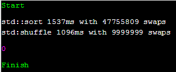
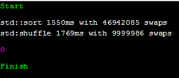
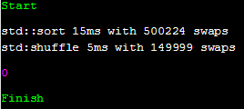
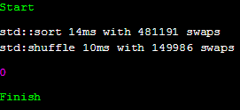

## Intro

우리는 알고리즘 시간에 Big-O에 대해서 배우고, O(N logN)은 O(N) 보다 느리다고 배운다. 그리고 이 차이는 원소의 개수가 클 수록 더 크게 난다. 물론 이 말은 일반적으로 옳은 이야기이지만, 실제 프로그래밍을 할 때에는 이 이외에 생각하지 못한 요소 때문에 성능에 영향을 주는 일이 생길 수도 있다.
최근 검색을 하다 [스택오버플로우](https://stackoverflow.com/questions/32586825/why-is-stdshuffle-as-slow-or-even-slower-than-stdsort?utm_medium=organic&utm_source=google_rich_qa&utm_campaign=google_rich_qa)에서 재미있는 글을 봤다. 글의 요지는 왜 std:shuffle이 std::sort 보다 느리냐는 것이었다. c++의 std에서 sort는 퀵소트를 사용하므로 O(N logN), shuffle은 O(N)의 복잡도를 가지고 있는데 일반적으로 생각하면 이상한 일이 아닐 수 없다.

## 직접 코드를 돌려보자

먼저 실제 동일한 결과가 나오는지 직접 실행을 해보는 것이 가장 정확하다. 이와 같은 간단한 테스트를 위해 좋은 도구가 바로 WandBox같은 사이트이다. 코드를 바로 실행해 결과를 확인할 수 있고, 컴파일러나 언어의 버전도 쉽게 선택 가능하다. 실행한 코드는 다음과 같다.

```c++
#include <iostream>

#include <vector>
#include <random>
#include <chrono>
#include <algorithm>

struct IntWithSwapRecord {
    IntWithSwapRecord(int i = 0) : i(i) {}
    int i;
    static int swap_count;

    friend void swap(IntWithSwapRecord& mine, IntWithSwapRecord& other)
    {
        ++swap_count;
        std::swap(mine.i, other.i);
    }

    bool operator < (const IntWithSwapRecord& other) const
    {
        return i < other.i;
    }
};

int IntWithSwapRecord::swap_count = 0;

using std::chrono::high_resolution_clock;
using std::chrono::duration_cast;
using std::chrono::milliseconds;

int main()
{
    std::vector<IntWithSwapRecord> v(10000000);

    std::minstd_rand gen(std::random_device{}());
    std::generate(v.begin(), v.end(), gen);

    auto s = high_resolution_clock::now();
    std::sort(v.begin(), v.end());
    std::cout << "std::sort " << duration_cast<milliseconds>(high_resolution_clock::now() - s).count() 
        << "ms with " << IntWithSwapRecord::swap_count << " swaps\n";

    IntWithSwapRecord::swap_count = 0;
    s = high_resolution_clock::now();
    std::shuffle(v.begin(), v.end(), gen);
    std::cout << "std:shuffle " << duration_cast<milliseconds>(high_resolution_clock::now() - s).count() 
        << "ms with " << IntWithSwapRecord::swap_count << " swaps\n";
}
```

## 결과 확인: 진짜 느릴까?

다음은 WandBox에서 두 종류의 컴파일러로 위 코드를 돌렸을 때 출력되는 결과물이다.

조건 1 : gcc 8.0.1
```
$ g++ prog.cc -Wall -Wextra -std=c++17 "-O2"
```


sort의 swap 횟수가 약 4.7배 가량 많지만 수행 시간은 1.5배 밖에 차이가 안 난다.

조건 2: clang 7.0.0
```
$ clang++ prog.cc -Wall -Wextra -std=c++17 "-O2"
```


clang의 경우 shuffle의 시간이 더 오래 걸렸다.

결과는 위 스택오버플로우의 질문처럼 swap 횟수에 비해 shuffle이 더 느린 것처럼 보이고, 심지어 sort보다 더 오래 걸린 경우도 있었다.

## 왜 느릴까?

다행히 위 질문에는 답변이 여러 개 달려 있었고, 답변을 통해 이러한 현상의 원인을 추측할 수 있었다. 결론부터 이야기 하자면 결국 CPU의 캐시 문제로 생각된다.
하드 드라이브가 느리기 때문에 실행중인 프로그램만 메모리에 올려놓는 것처럼, 오늘날의 CPU는 메모리도 느리다고 생각하기 때문에 지금 작업중인 부분을 올려놓기 위한 캐시를 가지고 있다. 우리가 흔히 L1, L2, L3라고 부르는 것들이다. 이 친구들은 CPU의 접근 속도가 메모리보다 훨씬 빠르기 때문에 작업속도를 높혀준다. 하지만 이 캐시에 올라와있지 않은 영역의 메모리가 계산에 필요해지면 다시 메모리까지 가서 해당 데이터를 캐시에 올려야 하는데 이러한 현상을 "캐시 미스"라고 부르고, (상대적으로) 이는 상당한 시간을 잡아먹게된다.
위 예제에서는 배열의 크기가 "10,000,000"으로 캐시에 모두 올리기에는 큰 크기이다. 따라서 shuffle을 할 때 캐시에 없는 메모리 영역을 자꾸 참조하게 되고 필연적으로 캐시 미스를 발생, 성능의 저하로 이어지는 것이다. 캐시에 대한 보다 자세한 설명은 [나무위키](https://namu.wiki/w/%EC%BA%90%EC%8B%9C%20%EB%A9%94%EB%AA%A8%EB%A6%AC) 를 참조하면 좋다.

## 조금 더 자세한 설명

셔플의 일반적인 구현은 배열을 순회하며 "랜덤한 인덱스" 위치의 값과 swap하는 것이다. 이를 배열의 길이만큼 반복하면 모든 원소가 랜덤한 위치에 들어갔다는 것이 보장되고 복잡도는 O(N)이 된다. 구현 코드를 간단히 표현하면 아래와 같다.
```c++
template<class RandomIt, class URBG>
void shuffle(RandomIt first, RandomIt last, URBG&& g)
{
    typedef typename std::iterator_traits<RandomIt>::difference_type diff_t;
    typedef std::uniform_int_distribution<diff_t> distr_t;
    typedef typename distr_t::param_type param_t;
 
    distr_t D;
    diff_t n = last - first;
    for (diff_t i = n-1; i > 0; --i) {
        using std::swap;
        swap(first[i], first[D(g, param_t(0, i))]);
    }
}
```
여기서 캐시 미스를 발생시키는 부분은 바로 랜덤한 인덱스에 대한 접근이다. 일반적으로 캐시는 "한 번 사용한 데이터 주변의 데이터를 또 사용할 확률이 높다"는 전제하에 한 번 가져올 때 필요한 데이터 주변의 데이터도 같이 가져온다. 배열에 순차적으로 접근하는 경우 이러한 전략은 매우 효율적이다. 혹은 배열의 크기가 작은 경우에도 전체 배열을 캐시로 불러올 수 있으므로 효율적이다. 하지만 위 실험처럼 크기가 매우 큰 배열에 랜덤으로 접근한다면 이러한 전략은 효율이 떨어지게 되고, 잦은 캐시 미스로 성능의 저하를 가져온다.
이에 반해 퀵소트의 구현을 생각해보자. 퀵소트는 배열에서 임의의 pivot을 설정한 다음, 해당 pivot과 범위 안의 요소를 양 끝에서부터 "순차적으로" 비교하기 때문에 한 번 캐시에 메모리를 올리면 한 번 가져온 메모리를 다 순회할 때까지 캐시 미스가 나지 않는다. 또한 정렬 과정을 몇 번 반복한 뒤에는 비교할 영역의 크기가 캐시에 다 들어올 수 있을 만큼 작아질 것이고, 재귀적으로 작업을 수행하므로 이전에 사용했던 캐시를 재사용 할 수 있을 확률도 늘어난다. 이러한 차이로 인해 std::sort는 작업을 4.7배 가량 더 많이 수행하면서도 std::shuffle보다 시간이 적게 걸릴 수 있는 것이다.

## 추측에 대한 확인

만약 위에서 설명한 것처럼 캐시 메모리의 크기가 문제라면 배열의 크기가 작은 경우 성능의 차이가 거의 나지 않아야 한다. 정말 그런지 한 번 확인해 보았다.

조건 1: gcc 8.0.1, SIZE 150,000
```
$ g++ prog.cc -Wall -Wextra -std=c++17 "-O2"
```


조건 2: clang 7.0.0, SIZE 150,000
```
$ clang++ prog.cc -Wall -Wextra -std=c++17 "-O2"
```


정확히 얼만한 크기를 가져야 하는지 알 수 없어 배열의 크기를 점진적으로 줄여가며 테스트를 하던 도중, 크기가 15만일 때 가장 유의미한 결과가 나왔다. 상대적으로 배열의 크기가 작아질수록 shuffle의 속도가 sort와 같아지는 효과가 있었고, swap 횟수와 시간 모두 약 3배 정도 차이가 나는 경우도 있었다. int가 4 바이트라고 할 떄, 15만 배열의 크기는 585KB이다.
clang에서 shuffle의 속도가 gcc에 비해 2배 가량 느린 이유는 random 함수의 속도 차이, 혹은 shuffle의 내부 구현의 차이 때문인 것 같다. 실제로 clang의 경우 swap 횟수가 gcc에 비해 조금 적다.