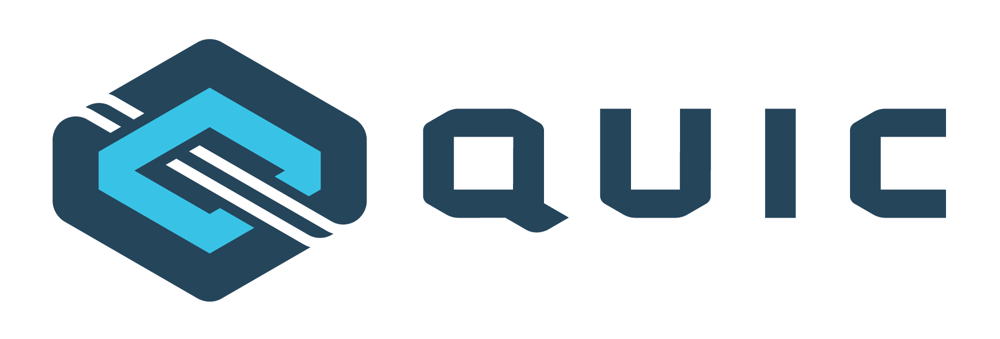
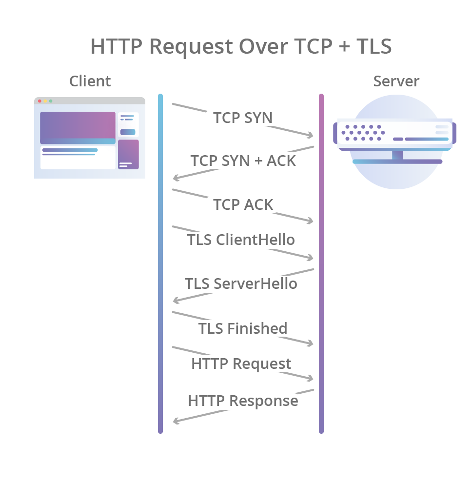
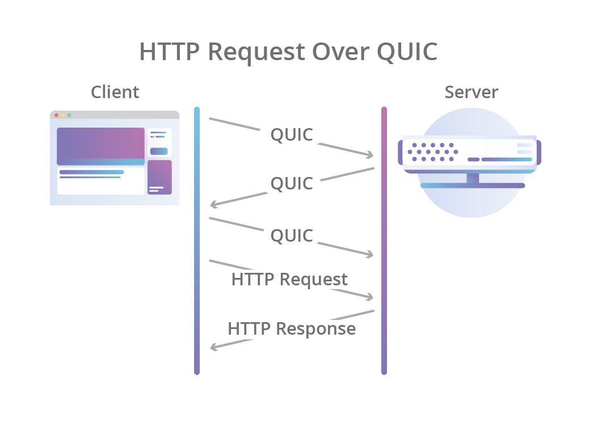
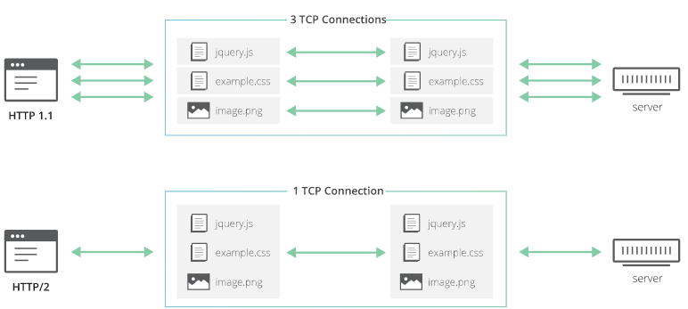
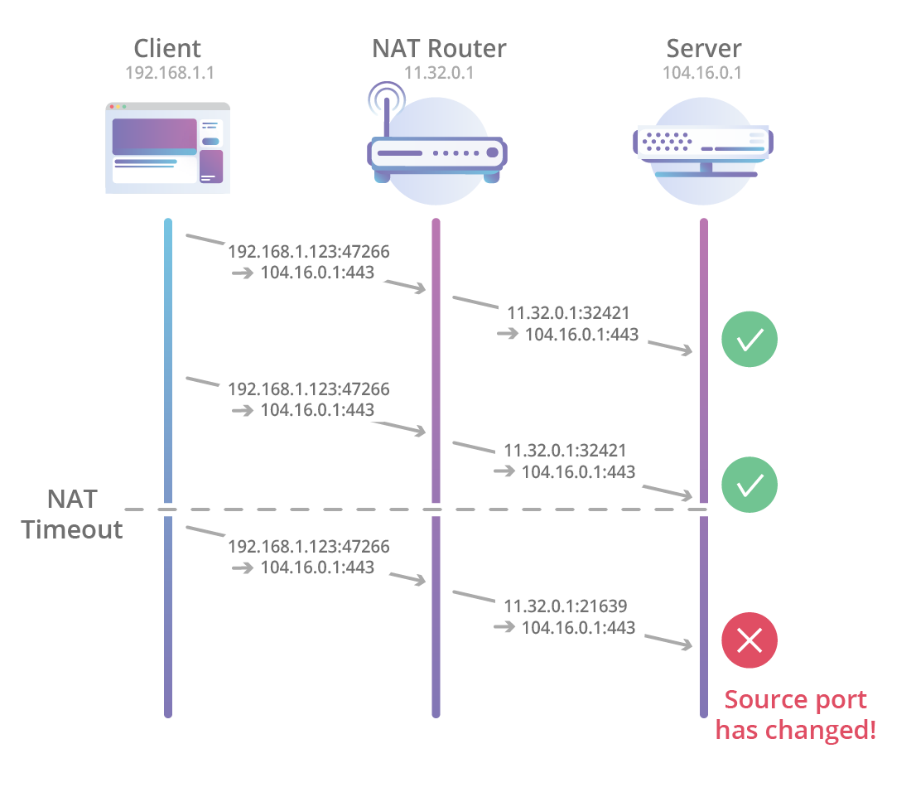
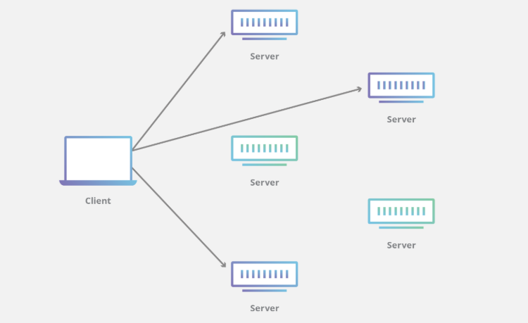
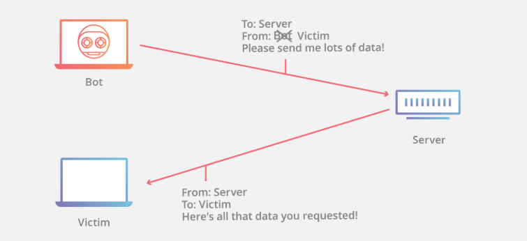

## Intro

Cloudflare의 기술 블로그에 올라와있는 [QUIC 관련 글을](https://blog.cloudflare.com/the-road-to-quic/) 번역한 글이다. 해당 블로그에 글이 올라온 날짜는 2018년 7월로 현재 상황과는 정확히 일치하지 않을 수 있다. QUIC에 대한 좀 더 기본적인 설명은 [HTTP/3 explained](https://http3-explained.haxx.se/ko) 라는 문서를 참고하면 좋다.

# QUIC을 향한 여정

QUIC (Quick UDP Internet Connections)은 암호화가 기본적으로 탑재된 새로운 인터넷 전송 프로토콜로, HTTP 트래픽을 더 안전하고 빠르게 전송하기 위한 여러 가지 개선사항들을 포함하고 있다. 그 목표는 점차적으로 웹의 TCP와 TLS를 대체하는 것이다. 이 블로그 포스트에선 QUIC의 핵심 기능들을 나열하고, 그것들이 어떻게 웹을 이롭게 하는 지, 그리고 이 파격적인 새 프로토콜을 지원하기 위한 도전들에 대해 이야기해본다.

사실 QUIC이라는 이름을 사용하는 프로토콜은 두 개가 있다. “Google QUIC” (이하 “gQUIC”)은 몇 년 전 구글 엔지니어들이 만든 오리지날 프로토콜로, 몇 년 동안의 실험 끝에 IETF (Internet Engineering Task Force)에 의해 표준으로 받아들여졌다.

“IETF QUIC” (이하 “QUIC”)은 gQUIC에서 갈라져 나와 많은 변화를 통해 별개의 프로토콜이 되었다. 더 빠르고 안전한 인터넷이라는 공동의 목표를 위해 많은 기관들과 개인들의 공개된 참여로 패킷의 전송 포멧, 핸드쉐이크, HTTP 맵핑 등 기존의 gQUIC를 많이 발전시켰다.

그럼 QUIC은 어떤 장점이 있을까?

## 내장된 보안(과 퍼포먼스)

기존의 TCP와 QUIC의 가장 큰 차이점 중 하나는 QUIC이 기본적으로 보안을 갖추고 있는 전송 프로토콜이라는 점이다. QUIC은 인증과 암호화 등의 보안 기능을 기본적으로 제공한다. 기존에는 일반적으로 TLS와 같은 더 높은 계층에서 제공하던 기능을 전송 프로토콜에서 자체적으로 제공하는 것이다.

초창기 QUIC의 핸드쉐이크는 TCP가 사용하는 기존의 3-way 핸드쉐이와 TLS 1.3의 핸드쉐이크를 합쳐 엔드포인트의 인증과 암호화 파라미터의 조절 기능을 제공했다. TLS 프로토콜에 익숙하다면 QUIC이 TLS의 핸드쉐이크 메시지는 그대로 유지한 채 TLS 레코드 계층을 자체적인 프레이밍 포멧으로 바꾼다고 이야기할 수도 있다.

이를 통해 연결이 항상 암호화되고 인증되는 것뿐만 아니라 최초 연결 생성을 더 빠르게 하는 결과를 얻을 수 있다. TCP와 TLS 1.3은 각각 한 번씩 두 번의 왕복이 필요한 반면, 일반적인 QUIC 핸드쉐이크는 클라이언트와 서버 사이를 한 번만 오가면 된다.

하지만 여기서 QUIC은 더 발전해 미들박스에 의해 남용되어 연결에 지장을 줄 수 있는 추가적인 연결 메타데이터도 암호화한다. 예를 들어 연결 마이그레이션 등이 발생해 여러 개의 네트워크 경로가 사용될 때, 소극적 공격자(passive attacker)들은 특정 유저의 활동을 특정하기 위해 패킷 번호를 사용하곤 한다. 이 패킷 번호를 암호화함으로써 QUIC은 연결의 엔드포인트 이외에 다른 누구도 활동을 특정할 수 없게 한다.

`고착화(ossification)`는 네트워크 프로토콜의 유연성이 지속적으로 감소하는 것으로, 오랫동안 변화가 없는 상태로 머무는 네트워크의 미들박스에 의해 발생한다. 미들박스는 인터넷의 방화벽, 대규모 NAT 프록시 등이 있으며 과도하게 프로토콜 필드를 검사해 프로토콜 확장을 위해 남겨둔 필드들을 사용할 수 없게 만든다. 이는 인터넷의 end-to-end 원칙을 깨는 것이다. 일례로 TLS 1.3을 적용할 때 TLS 1.2만 지원하는 미들박스들로 인해 난항을 겪기도 했다. 이로 인해 TLS 1.3의 도입이 오랫동안 지연되었으며 여러 우회 방법을 사용해야만 했다. 메타데이터 암호화는 이러한 골화 현상을 방지하기 위한 효과적인 처방전이기도 하다.

## Head-of-line(HOL) 블로킹

HTTP/2의 핵심 변화 중 하나는 서로 다른 HTTP 요청들을 하나의 TCP 연결에서 처리할 수 있게 하는 것이었다. 이로 인해 HTTP/2를 사용한 프로그램은 요청들을 동시에 처리해 네트워크 대역폭을 더 효율적으로 사용할 수 있었다.

이는 HTTP/1.1에서 여러 개의 요청을 동시에 처리하려면 그만큼 새로운 TCP+TLS 연결을 생성해야 했던 것에 비하면 큰 발전이다. 예를 들면 브라우저가 웹페이지를 그리기 위해 CSS와 Javascript를 가져와야 하는 경우가 있다. 새 연결을 맺는 것은 초기 핸드쉐이크 과정을 여러 번 반복해야 하고, 초기 혼잡 방지 상태도 벗어나야 하기 때문에 웹 페이지를 그리는 속도가 느려진다. 멀티플렉싱 HTTP 전송은 이 모든 문제를 해결해준다.

하지만 여기에는 단점도 존재한다. 여러 개의 요청/응답이 같은 TCP연결에서 이루어지기 때문에 네트워크 혼잡 상태 등에 의해 발생하는 패킷 손실에 모두가 영향을 받는다. 하나의 요청에서만 손실이 일어나도 모두 영향을 받는 이러한 상황을 `head-of-line 블로킹`이라고 부른다.

QUIC은 이를 해결하기 위해 QUIC 전송 스트림을 각각의 HTTP 스트림과 매핑하는 동시에 QUIC 연결은 하나만 유지한다. 따라서 추가적인 핸드쉐이크도 필요 없고, 혼잡 상황이 전파되지도 않는다. QUIC은 각 스트림이 독자적으로 전달되기 때문에 대부분의 패킷 손실 상황에서 다른 전송에 영향을 주지 않는다.

따라서 위에서 이야기했던 웹 페이지를 불러오는 상황(CSS, Javacript, 이미지 등 여러 파일 필요)에서 극적인 속도 향상을 가져온다. 특히 네트워크가 혼잡해 패킷 손실이 심한 경우 더 빛을 발한다.

## 쉬울까?

이러한 기능을 구현하기 위해 QUIC 프로토콜은 다른 많은 네트워크 응용 프로그램이 당연하게 받아들이고 있는 내용들 중 일부를 파괴한다. 이는 QUIC를 구현하고 배포하는 것을 더 어렵게 만든다.

QUIC는 대부분의 네트워크 장비들이 이미 지원하고 있는 UDP를 사용한다. 그럼으로써 배포가 용이해지고 네트워크 장비들이 미확인 프로토콜로 분류해 패킷을 버리는 일을 방지한다. 또한 QUIC의 구현을 사용자의 영역으로 미루어 운영체제의 업데이트 없이도 새로운 프로토콜 기능을 구현하고 배포할 수 있게 된다.

하지만 이러한 장점이 생기는 것은 맞지만 악용되는 것을 막고 라우팅 패킷들이 올바른 엔드 포인트에 잘 도달하게 하는 것을 더 어렵게 만들기도 한다.

## 하나의 NAT가 모두를 눈멀게 할 수 있다

일반적인 NAT 라우터는 전통적인 4-tuple(발신지 IP와 포트, 목적지 IP와 포트)을 사용해 자신을 지나가는 TCP 연결들을 추적할 수 있다. 그리고 네트워크상의 TCP SYN, ACK, FIN 패킷을 감지해 언제 새 연결이 생겨났고 사라졌는지 알 수 있다. 이로 인해 내, 외부 IP 주소와 포트 사이의 NAT 바인딩의 생명 주기를 정교하게 관리할 수 있다.

QUIC에서는 아직 이러한 내용이 가능하지 않다. 전 세계의 NAT 라우터는 QUIC을 모르기 때문에 기존의 정교하지 않은 UDP 핸들링 흐름을 따를 것이다. 그 타임아웃 시간이 매우 짧기 때문에 오랫동안 유지되어야 하는 연결에 지장을 줄 수 있다.

타임아웃 등으로 인해 NAT에서 재 바인딩이 일어난다면 NAT 외부의 엔드포인트에서 오는 포트가 처음 연결이 생성되었던 포트와 달라질 것이다. 이렇게 되면 4-tuple만 가지고는 연결을 추적할 수 없게 된다.

NAT만 문제인 것은 아니다. QUIC이 제공하는 기능 중 `연결 마이그레이션`은 필요에 의해 QUIC의 엔드포인트가 다른 IP 주소와 네트워크 경로를 사용하도록 연결을 마이그레이션 할 수 있다. 예를 들어 모바일 클라이언트가 데이터로 통신을 하다가 카페에 들어와 와이파이에 연결이 된다면 이 연결을 마이그레이션 할 수 있게 된다.

QUIC은 연결 ID를 사용해 이러한 문제를 해결하려 한다. QUIC 패킷에 가변적인 크기의 데이터를 추가해 연결을 구분하는 것이다. 엔드 포인트는 기존의 4-tuple 대신 이 ID를 사용해 연결을 추적하게 된다. 실제로는 같은 연결을 가리키는 여러 개의 ID가 존재할 수 있다. 연결 마이그레이션이 일어났을 때 다른 경로로 링크되는 것을 방지하기 위함이다. 하지만 그 행동은 미들박스가 아니라 엔드포인트에서 관리한다.

하지만 하나의 목적지 IP 주소가 수백, 수천 개의 서버를 가리킬 수 있는 애니캐스트 주소나 ECMP 라우팅을 사용하는 네트워크 망 사업자들에게는 이 또한 문제가 될 수 있다. 엣지 라우터(edge router)도 QUIC 트래픽을 어떻게 다루어야 할지 모르기 때문에 같은 QUIC 연결에 속한, 즉 같은 QUIC ID를 가지고 있는 UDP 패킷이 NAT 리바인딩이나 연결 마이그레이션 등으로 인해 다른 4-tuple을 가지게 된다면 다른 서버로 라우트되어 연결이 끊어지게 될 수 있다.

이를 올바르게 전송하기 위해 네트워크 망 사업자들은 더 똑똑한 4 계층 로드 밸런싱 솔루션을 도입해야 할 수도 있다. 이렇게 하면 엣지 라우터를 건드릴 필요 없이 소프트웨어적으로 구현 및 배포할 수 있게 된다. (예시: 페이스북의 Katran 프로젝트의)

## QPACK

HTTP/2의 또다른 장점 중 하나는 헤더압축(혹은 HPACK) 으로, HTTP 요청과 응답의 중복되는 부분을 제거해 HTTP/2 엔드포인트에 전송되는 데이터의 양을 줄이는 것이다.

HPACK은 이전의 HTTP 요청이나 응답의 헤더를 사용해 동적 테이블(dynamic table)을 만들어 엔드포인트가 새 요청이나 응답에서 헤더를 다시 전부 전송하는 대신 이전의 헤더를 사용할 수 있도록 동작한다.

HPACK의 동적 테이블은 인코더(HTTP 요청이나 응답을 보낸 쪽)와 디코더(받는 쪽)에서 항상 동일해야 한다. 그렇지 않으면 디코더가 받은 내용을 해석할 수 없을 것이다.

TCP를 통한 HTTP/2의 경우 이 전송 계층(TCP)이 HTTP 요청과 응답의 순서를 보장해주기 때문에 동기화 하는 것이 명확하다. 동적 테이블이 업데이트 되어야 할 경우 인코더가 요청이나 응답을 보낼 때 같이 담아서 보내면 된다. 하지만 QUIC에서는 더 복잡 해진다.

QUIC는 여러 개의 HTTP 요청이나 응답을 서로 다른 스트림으로 보낼 수 있기 때문에, 각 스트림에서의 순서는 보장되지만 여러 개의 스트림들 사이의 순서는 보장되지 않는다.

예를 들어 만약 클라이언트가 QUIC 스트림 A를 사용해 A라는 HTTP 요청을 보내고, 스트림 B에 B라는 요청을 보낸다면 네트워크에서 패킷 재정렬이나 손실에 의해 B라는 요청이 서버에 먼저 도달할 수 있게 된다. 만약 요청 B가 요청 A에 담겨있는 헤더를 사용해 인코딩이 되어 있다면 요청 A가 도달하기 전까지는 읽을 수 없을 것이다.

gQUIC 프로토콜은 모든 HTTP 요청과 응답의 헤더를(바디는 말고) 같은 gQUIC 흐름으로 직렬화 하여 해결했다. 이렇게 하면 헤더의 도착 순서는 항상 보장된다. 이는 기존의 HTTP/2 코드 대부분을 재사용할 수 있게 해주는 아주 간단한 방법이다. 하지만 QUIC이 줄이고자 했던 head-of-line 블로킹을 증가시키게 된다. IETF QUIC 제작자들은 HTTP와 QUIC 사이의 새로운 맵핑(`HTTP/QUIC`)과 더불어 새로운 압축 전략을 만들어 `QPACK`이라 이름 붙였다.

최신의 HTTP/QUIC 맵핑과 QPACK 스펙을 보면 각 HTTP 요청/응답은 고유의 양방향 QUIC 스트림을 바꿔가며 사용하기 때문에 head-of-line 블로킹이 일어나지 않는다. 또한 QPACK을 지원하기 위해 각 피어는 추가로 두 개의 단방향 QUIC 스트림을 만드는데, 하나는 QPACK 테이블 업데이트를 다른 피어에게 보내기 위해 사용하고 다른 하나는 다른 피어에서 업데이트를 잘 받았는지 확인하기 위해 사용한다. 이렇게 하면 QPACK 인코더는 디코더가 동적 테이블을 업데이트 했음을 명시적으로 확인할 수 있다.

## 반사 회피

UDP 기반 프로토콜의 공통적인 약점은 반사 공격에 취약하다는 것이다. 공격자가 서버 하나를 속여서 대량의 데이터를 희생자인 제 3자에게 보내게 만드는 것이다. 공격자는 패킷의 발신지의 IP 주소를 변경해 대상 서버에게 보내 마치 희생자가 보낸 패킷처럼 위장한다.

이런 종류의 공격은 보통 서버에서 보내는 응답이 받은 요청보다 더 크기 때문에 매우 효율적이다. 이런 경우 `증폭`한다고 이야기한다.

TCP는 이런 종류의 공격에 사용되지 않는데, 핸드쉐이크 동안 전송되는 초기 패킷(SYN, SYN+ACK, …)의 길이가 같기 때문에 증폭이 일어날 가능성이 없기 때문이다.

반면에 QUIC의 핸드쉐이크는 매우 비대칭적이다. TLS와 마찬가지로, 클라이언트가 몇 바이트(QUIC 패킷 안에 담긴 TLS ClientHello 메시지)만 보내도 서버는 보통 인증 정보를 담은 매우 큰 데이터를 돌려준다. 이러한 이유로 클라이언트가 보낸 최초의 QUIC 패킷은 심지어 실제 내용이 훨씬 작더라도 특정 크기까지 채워져서 와야 한다. 하지만 일반적으로 서버의 응답은 여러 개의 패킷을 보내는 경우도 있기 때문에 여전히 요청보다 훨씬 더 커질 수 있기 때문에 완벽한 해결책은 아니다.

QUIC 프로토콜은 또한 발신지-주소를 명시적으로 확인하기 위해 확인 매커니즘을 사용한다. 서버가 긴 응답을 보내는 대신 고유의 암호화 토큰을 담은 훨씬 작은 `재시도` 패킷을 보내면 클라이언트는 그 정보를 포함한 새로운 패킷을 서버에 보낸다. 클라이언트가 재시도 패킷 정상적으로 받았기 때문에 서버는 클라이언트가 발신지 IP 주소를 속이는 것이 아니라고 좀 더 확실하게 믿고 핸드쉐이크를 마칠 수 있게 된다. 패킷이 한번이 아니라 두 번 왕복해야 하기 때문에 초기 핸드쉐이크 시간이 느려지는 단점이 있다.

또다른 방법으로는 서버의 응답을 반사 공격이 효과적이지 않게 될 때까지 줄이는 것이 있다. 예를 들어 일반적으로 RSA 보다 훨씬 작은 ECDSA 인증서를 사용하는 방법이 있다. 우리는 또한 zlib나 brotli 같은 기존의 압축 알고리즘을 사용해 TLS 인증서를 압축하는 방법을 실험해보고 있다. 이러한 기능은 기존에 gQUIC에 들어갔지만 TLS에서는 현재 지원하지 않는다.

## UDP 성능

QUIC에 관해 계속 제기되는 이슈 중 하나는 기존에 설치되어 있는 하드웨어와 소프트웨어가 이걸 이해할 수 없다는 것이다. 우리는 이미 어떻게 QUIC가 라우터 같은 네트워크의 미들박스들에 대처하는지 알아봤다. 하지만 UDP를 통해 데이터를 주고받는 QUIC 엔드포인트 그 자체가 성능상의 문제를 가져올 것이라는 전망도 있다. 지난 세월 동안 TCP의 구현을 최대한 최적화하기 위해 운영체제와 같은 소프트웨어나 네트워크 인터페이스 같은 하드웨어들에 많은 연구가 있었지만, 이러한 내용들은 UDP에 적용할 수 없다.

하지만 QUIC 구현이 이러한 혜택을 누리는 것은 시간 문제일 뿐이다. 최근 Linux에서 UDP를 위한 Generic Segmentation Offloading을 구현했다. 이로 인해 프로그램이 유저 공간과 커널 공간의 네트워크 스택 간의 여러 개의 UDP 세그먼트를 묶어서 하나(혹은 거의 하나)의 비용만으로 전송할 수 있게 되었다. 또한 프로그램이 유저 공간의 메모리를 커널 공간으로 복사하는데 드는 비용을 줄여주는 zeroycopy socket support도 추가되었다.

## 결론

HTTP/2와 TLS 1.3 처럼, QUIC는 웹 사이트 등 인터넷 기반 요소의 보안과 속도를 높이기 위해 많은 새로운 기능들을 추가했다. IETF는 QUIC 명세의 첫 번째 버전을 올해(2018년) (2019년 7월로 연기되었다) 말까지 제공하기 위해 노력중이고, Cloudflare의 엔지니어들은 QUIC의 혜택을 고객들에게 제공하기 위한 준비를 마쳤다.